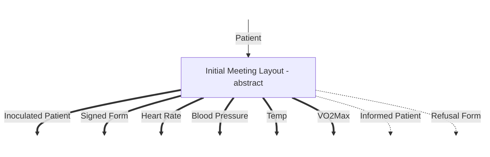
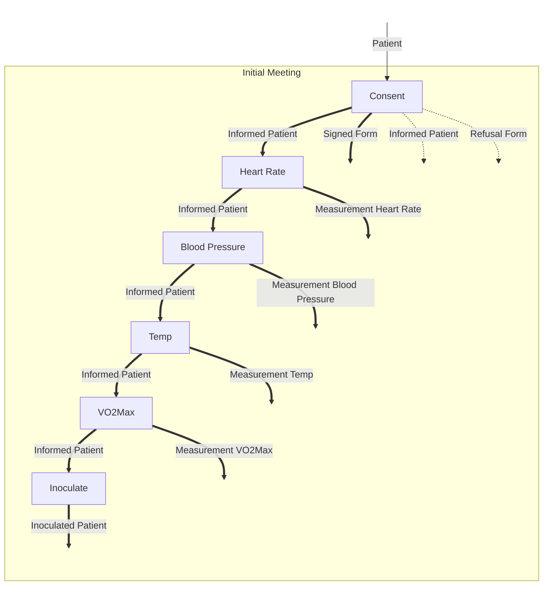

# Refinement by Substitution

A Box has an input Product type and an output Sum type, where each branch is a Product type. It can be abstract or concrete.
If abstract, it can be substituted by a network of Boxes with the same inputs and outputs. In the end, we want a network of
concrete Boxes with types lined up correctly.

Since each output is a disjunction of conjunctions, each output can be named with two numbers - the index of the conjunct and
index of the disjunct. As each input is just a Product, it can be named with the indices of the projections. This way we can tie
together inputs and outputs. We can tie together elements of two disjuncts from the same Box by unifying them, so that whichever
disjunct comes from a Box, overlapping elements of the product can go into the same successor Box.

Likewise we need a way of ensuring strings from different disjuncts don't get improperly mixed. For a later version.

Consider the first meeting of a Patient in a Clinical Trial. The outcome is either:

- Success:
  - Signed consent form
  - Various measurements
    - Heart rate
    - Blood pressure
    - Temperature
    - VO2Max (just want something that's not easy to get, requiring some search)
  - Inoculated patient
- Failure
  - Patient
  - Refusal form (some explanation)

So the Box is something like

This obviously has nothing to perform any of the needed procedures, so we substitute

