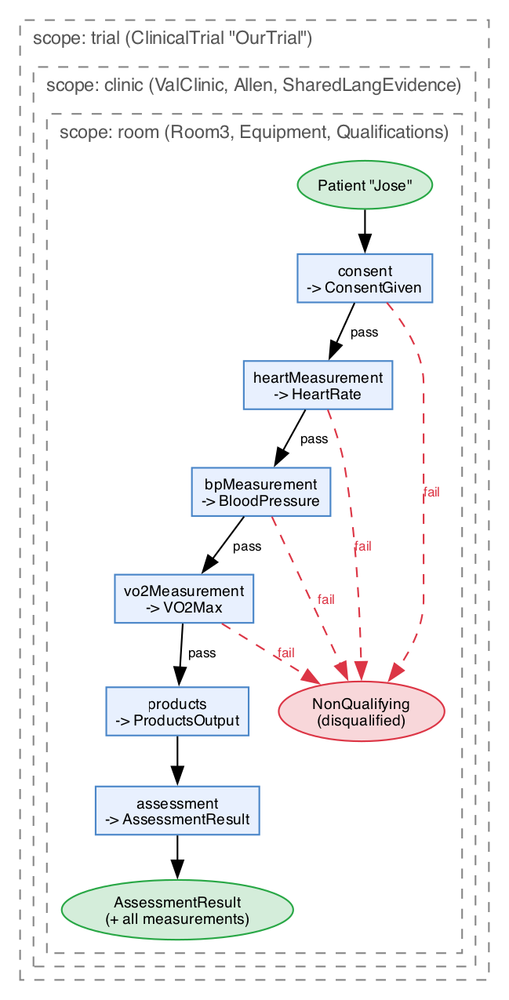
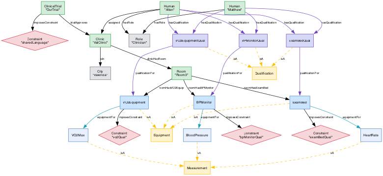

# Knowledge Base: Types, Facts, Ontology, Actions & Constraints

This document describes the current state of the clinical trial knowledge base. The KB lives in two places: **Lean4 source** (type-level specifications and proofs) and **Neo4j** (queryable ground facts and catalog). Both agents — the Proof Agent (formal Lean) and the Designer Agent (natural language) — query the same graph.

---

## 1. Entity Types

### People & Roles

| Type | Parameters | Description |
|------|-----------|-------------|
| `Human s` | name : String | A person in the system |
| `Role` | — (enum) | Patient, Administrator, or Clinician |
| `Patient s` | name : String | Patient marker (pipeline domain type) |
| `Clinician s` | name : String | Clinician marker (pipeline domain type) |

### Geography

| Type | Parameters | Description |
|------|-----------|-------------|
| `Language s` | name : String | A spoken language |
| `City s` | name : String | A city |
| `Clinic s` | name : String | A clinical facility |

### Clinical Infrastructure

| Type | Parameters | Description |
|------|-----------|-------------|
| `ClinicalTrial s` | name : String | A clinical trial |
| `Room s` | name : String | A room within a clinic |
| `ExamBed` | — (unit) | Exam bed equipment |
| `BPMonitor` | — (unit) | Blood pressure monitor |
| `VO2Equipment` | — (unit) | VO2 max measurement equipment |

### Qualifications

| Type | Parameters | Description |
|------|-----------|-------------|
| `ExamBedQual` | — (unit) | Certification to operate an exam bed |
| `BPMonitorQual` | — (unit) | Certification to operate a BP monitor |
| `VO2EquipmentQual` | — (unit) | Certification to operate VO2 equipment |

Qualifications are standalone concepts. Who holds them is expressed via `hasQualification` edges:

| Relation | Description |
|----------|-------------|
| `holdsExamBedQual person q` | Person holds ExamBed certification |
| `holdsBPMonitorQual person q` | Person holds BP monitor certification |
| `holdsVO2EquipmentQual person q` | Person holds VO2 equipment certification |

---

## 2. Ground Facts

### Named Entities

| Category | Entities |
|----------|---------|
| Humans | Jose, Rick, Allen, Matthew |
| Languages | English, Spanish, French |
| Cities | Valencia, London, Nice, Paris |
| Clinics | ValClinic, NiceClinic, ParisClinic, LondonClinic |
| Trials | OurTrial |
| Rooms | Room3 |
| Equipment | ExamBed, BPMonitor, VO2Equipment |
| Qualifications | ExamBedQual, BPMonitorQual, VO2EquipmentQual |

### Relations

**Roles** — who plays what role:

| Person | Role |
|--------|------|
| Jose | Patient |
| Rick | Administrator |
| Allen | Clinician |
| Matthew | Clinician |

**Languages** — who speaks what:

| Person | Languages |
|--------|----------|
| Jose | Spanish |
| Rick | English |
| Allen | English, Spanish |
| Matthew | English, French |

**Geography** — who lives where, clinics in cities:

| Fact | |
|------|--|
| Jose lives in Valencia | |
| ValClinic is in Valencia | |
| NiceClinic is in Nice | |
| ParisClinic is in Paris | |
| LondonClinic is in London | |

**Assignments** — clinicians assigned to clinics:

| Clinician | Clinic |
|-----------|--------|
| Rick | LondonClinic |
| Allen | ValClinic |
| Matthew | NiceClinic |

**Qualifications** — who holds what certification:

| Person | Qualifications |
|--------|---------------|
| Allen | ExamBedQual, BPMonitorQual, VO2EquipmentQual |
| Matthew | ExamBedQual, BPMonitorQual, VO2EquipmentQual |

### Containment Graph

The containment graph defines physical nesting. Each level brings entities — and their constraints — into scope.

```
OurTrial
  └── trialApproves → ValClinic
                         └── clinicHasRoom → Room3
                                               ├── roomHasExamBed → ExamBed
                                               ├── roomHasBPMonitor → BPMonitor
                                               └── roomHasVO2Equip → VO2Equipment
```

### Derived Proof: Legal Meeting

`joseMeetingAllen` proves that Allen (clinician, assigned to ValClinic, speaks Spanish) can legally take measurements for Jose (patient, lives in Valencia, speaks Spanish). This discharges all conditions: shared city, shared language, correct roles, and assignment.

---

## 3. isA Hierarchy

Three ontological categories organize the domain types:

```
Equipment
  ├── ExamBed
  ├── BPMonitor
  └── VO2Equipment

Qualification
  ├── ExamBedQual
  ├── BPMonitorQual
  └── VO2EquipmentQual

Measurement
  ├── HeartRate
  ├── BloodPressure
  └── VO2Max
```

### Cross-cutting Links

**qualificationFor** — which qualification certifies which equipment:

| Qualification | Equipment |
|--------------|-----------|
| ExamBedQual | ExamBed |
| BPMonitorQual | BPMonitor |
| VO2EquipmentQual | VO2Equipment |

**equipmentFor** — which equipment produces which measurement:

| Equipment | Measurement |
|-----------|------------|
| ExamBed | HeartRate |
| BPMonitor | BloodPressure |
| VO2Equipment | VO2Max |

These links let agents reason structurally: given equipment, discover what qualification is needed and what measurement it produces.

---

## 4. Scopes

The pipeline operates inside nested scopes. Entering a scope introduces entities into the type-level context. Exiting removes them. Constraints imposed by entities in a scope apply to all actions within it.

### Scope Layers

| Scope | Entities Introduced | Constraints Imposed |
|-------|-------------------|-------------------|
| **Trial** (`trialExt`) | ClinicalTrial "OurTrial" | sharedLanguage |
| **Clinic** (`clinicExt`) | Clinic "ValClinic", Clinician "Allen", SharedLangEvidence "Allen" "Jose" | *(none directly — language evidence satisfies the trial constraint)* |
| **Room** (`roomExt`) | Room "Room3", ExamBed, BPMonitor, VO2Equipment, holdsExamBedQual allen .mk, holdsBPMonitorQual allen .mk, holdsVO2EquipmentQual allen .mk | examBedQualification, bpMonitorQualification, vo2Qualification |

### Full Context Inside All Scopes

When all three scopes are entered (room inside clinic inside trial), the context has 12 typed objects:

| Index | Type | Source Scope |
|-------|------|-------------|
| 0 | Room "Room3" | Room |
| 1 | ExamBed | Room |
| 2 | BPMonitor | Room |
| 3 | VO2Equipment | Room |
| 4 | holdsExamBedQual allen .mk | Room |
| 5 | holdsBPMonitorQual allen .mk | Room |
| 6 | holdsVO2EquipmentQual allen .mk | Room |
| 7 | Clinic "ValClinic" | Clinic |
| 8 | Clinician "Allen" | Clinic |
| 9 | SharedLangEvidence "Allen" "Jose" | Clinic |
| 10 | ClinicalTrial "OurTrial" | Trial |
| 11 | Patient "Jose" | Initial |

Each action in the pipeline declares which of these it needs via its `inputs` telescope. A missing requirement is a type error.

---

## 5. Constraints

Constraints are **entity-scoped**: they are attached to the entity that imposes them via `imposesConstraint` edges. Agents discover applicable constraints by traversing the containment graph from their current scope.

### Constraint Definitions

| Constraint | English (Designer Agent) | Lean Type (Proof Agent) | Imposed By |
|-----------|------------------------|------------------------|------------|
| sharedLanguage | Clinician and patient must share a common language | `SharedLangEvidence` | ClinicalTrial "OurTrial" |
| examBedQualification | Operator must hold ExamBed certification | `ExamBedQual` | ExamBed |
| bpMonitorQualification | Operator must hold BP monitor certification | `BPMonitorQual` | BPMonitor |
| vo2Qualification | Operator must hold VO2 equipment certification | `VO2EquipmentQual` | VO2Equipment |

### Constraint Discovery

Constraints are **not** listed on actions. They are discovered structurally by following edges from the entities an action requires.

**Example:** "What constraints apply to `heartMeasurement`?"

1. `heartMeasurement` REQUIRES ExamBed (role: equipment)
2. ExamBed imposesConstraint → Constraint "examBedQualification"
3. The trial scope also applies: OurTrial imposesConstraint → Constraint "sharedLanguage"

**Result:** heartMeasurement requires both `ExamBedQual` and `SharedLangEvidence`.

### Scope Traversal

When an agent enters a scope, it inherits all constraints from the current level and above:

```
Enter trial OurTrial
  → sharedLanguage: "Clinician and patient must share a common language"

Enter clinic ValClinic (approved by OurTrial)
  → (no additional constraints)

Enter room Room3 (in ValClinic)
  → examBedQualification: "Operator must hold ExamBed certification"
  → bpMonitorQualification: "Operator must hold BP monitor certification"
  → vo2Qualification: "Operator must hold VO2 equipment certification"

Total in Room3: 4 constraints (1 trial + 3 equipment)
```

---

## 6. Actions

Each action is defined as both a Lean `Spec` (formal, type-checked) and a Neo4j `ActionSpec` node (queryable). The Lean spec is the authoritative definition; the Neo4j node mirrors it for agent access.

### Action Catalog

| Action | Description | Produces |
|--------|------------|----------|
| consent | Obtains informed consent from the patient | ConsentGiven |
| heartMeasurement | Measures the patient's heart rate using an exam bed | HeartRate |
| bpMeasurement | Measures the patient's blood pressure using a BP monitor | BloodPressure |
| vo2Measurement | Measures the patient's VO2 max using VO2 equipment | VO2Max |
| products | Aggregates all measurement results into a single output | ProductsOutput |
| assessment | Evaluates aggregated results to determine if patient qualifies | AssessmentResult |
| disqualify | Records patient disqualification with a reason | NonQualifying |

### Action Requirements

Each action declares what it REQUIRES, with a role indicating the relationship:

| Action | Role: subject | Role: operator | Role: equipment | Role: prerequisite |
|--------|:------------:|:--------------:|:---------------:|:-----------------:|
| consent | Patient | | | |
| heartMeasurement | Patient | Clinician | ExamBed | |
| bpMeasurement | Patient | Clinician | BPMonitor | |
| vo2Measurement | Patient | Clinician | VO2Equipment | |
| products | | | | ConsentGiven, HeartRate, BloodPressure, VO2Max |
| assessment | Patient | | | ProductsOutput |
| disqualify | Patient | | | |

### Output Types

Seven output types represent what actions produce. These are also nodes in Neo4j for structural queries:

| Output Type | Produced By | Category |
|------------|-------------|----------|
| ConsentGiven | consent | — |
| HeartRate | heartMeasurement | Measurement |
| BloodPressure | bpMeasurement | Measurement |
| VO2Max | vo2Measurement | Measurement |
| ProductsOutput | products | — |
| AssessmentResult | assessment | — |
| NonQualifying | disqualify | — |

---

## 7. Pipeline Structure

The full clinical pipeline composes all actions with branching for disqualification at each measurement stage.

### Pipeline Flow

{ width=55% }

### Two Outcomes

1. **Full qualification:** Patient "Jose" + ConsentGiven + HeartRate + BloodPressure + VO2Max + ProductsOutput + AssessmentResult
2. **Disqualification:** Patient "Jose" + NonQualifying (at any stage — consent refused, heart rate too fast, BP too high, or VO2 too low)

Four branch points, three joins. Each failure branch coalesces into the single NonQualifying outcome.

---

## 8. Neo4j Graph Topology

The complete graph after seeding contains the following structure. Node colors indicate type: green = entities, blue = equipment, purple = qualifications, yellow = categories, red diamonds = constraints, grey = roles/geography.



### Agent Queries

**Designer Agent** — "What constraints apply in Room3?"
```cypher
// Equipment constraints
MATCH (r:Room {name: "Room3"})-[]->(eq)-[:imposesConstraint]->(c:Constraint)
RETURN c.english, labels(eq)[0] AS imposedBy

// Trial constraints (traverse up containment)
MATCH (r:Room {name: "Room3"})<-[:clinicHasRoom]-(cl)
      <-[:trialApproves]-(t)-[:imposesConstraint]->(c:Constraint)
RETURN c.english, t.name AS imposedBy
```

**Proof Agent** — "What Lean types does heartMeasurement need?"
```cypher
// Direct requirements
MATCH (a:ActionSpec {name: "heartMeasurement"})-[r:REQUIRES]->(t)
RETURN labels(t)[0] AS type, r.role

// Constraints from required entities
MATCH (a:ActionSpec {name: "heartMeasurement"})-[:REQUIRES]->(eq)
      -[:imposesConstraint]->(c:Constraint)
RETURN c.leanType
```

**Designer Agent** — "What actions can I do with Room3's equipment?"
```cypher
MATCH (r:Room {name: "Room3"})-[]->(eq)-[:isA]->(:Equipment)
MATCH (a:ActionSpec)-[:REQUIRES {role: "equipment"}]->(eq)
RETURN a.name, a.description, labels(eq)[0] AS equipment
```

---

## 9. Source File Map

| File | Contents |
|------|----------|
| `KB/Types.lean` | Entity types, equipment types, qualification types, structural edge types |
| `KB/Relations.lean` | Basic relations (hasRole, speaks, lives, assigned, isIn), derived predicates, proof bundles |
| `KB/Facts.lean` | Named entities, ground relation facts, `joseMeetingAllen` proof |
| `KB/Arrow/Spec.lean` | Telescope (`Tel`), `Spec` structure (name, description, inputs, consumes, produces) |
| `KB/Arrow/Clinical.lean` | Domain types, evidence types, scope extensions, 7 arrows, full pipeline |
| `KB/ActionCatalog.lean` | Constraints, categories, output types, actions, isA/REQUIRES/PRODUCES, Cypher generation |
| `KB/Neo4j/Core.lean` | `Neo4jRepr` (.node/.edge with properties), `toCypher`/`toMatchCypher` |
| `KB/Neo4j/Instances.lean` | `ToNeo4j`/`FromNeo4j` instances for all KB types |
| `SeedNeo4j.lean` | Prints all Cypher statements (ground facts + catalog) for Neo4j ingestion |
