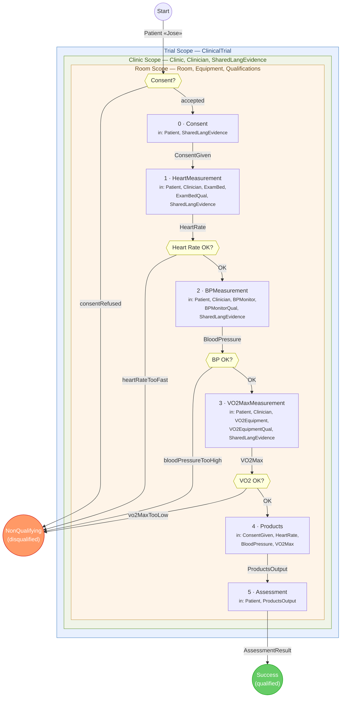

# scopedClinicalPipeline

Type-level wiring diagram for `scopedClinicalPipeline` defined in
`lean4/WorldModel/KB/Arrow/Clinical.lean`.

Each measurement can disqualify the patient.  All failure branches produce
`NonQualifying "Jose"` and are merged by three `.join`s into a single
disqualification outcome.



## Outcomes

| # | Context after scope exit | Meaning |
|---|--------------------------|---------|
| 1 | `[Patient "Jose", NonQualifying "Jose"]` | Patient disqualified at any step |
| 2 | `[Patient "Jose", ConsentGiven "Jose", HeartRate "Jose", BloodPressure "Jose", VO2Max "Jose", ProductsOutput "Jose", AssessmentResult "Jose"]` | Patient fully qualified |

## Stage descriptions

| # | Arrow | Inputs (from context) | Produces |
|---|-------|-----------------------|----------|
| 0 | `consentArrow` | `Patient`, `SharedLangEvidence` | `ConsentGiven` |
| 1 | `heartArrow` | `Patient`, `Clinician`, `ExamBed`, `ExamBedQual`, `SharedLangEvidence` | `HeartRate` |
| 2 | `bpArrow` | `Patient`, `Clinician`, `BPMonitor`, `BPMonitorQual`, `SharedLangEvidence` | `BloodPressure` |
| 3 | `vo2Arrow` | `Patient`, `Clinician`, `VO2Equipment`, `VO2EquipmentQual`, `SharedLangEvidence` | `VO2Max` |
| 4 | `productsArrow` | `ConsentGiven`, `HeartRate`, `BloodPressure`, `VO2Max` | `ProductsOutput` |
| 5 | `assessmentArrow` | `Patient`, `ProductsOutput` | `AssessmentResult` |

## Disqualification reasons

```lean
inductive DisqualificationReason : Type where
  | consentRefused : String → DisqualificationReason
  | heartRateTooFast
  | bloodPressureTooHigh
  | vo2MaxTooLow
```

All four failure branches use the same `nqArrow`, which finds `Patient "Jose"` in
the scope context and produces `NonQualifying "Jose"`.  The polymorphic
`insideAllScopesSel` drops any produced items so every failure branch sees
identical context — enabling the three `.join`s.

## Scope structure

| Scope | Extension | Provides |
|-------|-----------|----------|
| Trial | `trialExt` | `ClinicalTrial "OurTrial"` |
| Clinic | `clinicExt` | `Clinic "ValClinic"`, `Clinician "Allen"`, `SharedLangEvidence "Allen" "Jose"` |
| Room | `roomExt` | `Room "Room3"`, `ExamBed`, `BPMonitor`, `VO2Equipment`, `ExamBedQual "Allen"`, `BPMonitorQual "Allen"`, `VO2EquipmentQual "Allen"` |

On scope exit each extension is stripped from every outcome context, leaving
only `Patient "Jose"` plus the items produced by the pipeline steps.

## Wiring notes

- **Failure-on-left stacking**: each `.branch` puts the `NQ` outcome on the left.
  Four branches produce `[NQ, NQ, NQ, NQ, success]`; three `.join`s collapse to
  `[NQ, success]`.
- **`insideAllScopesSel`** uses `Selection.prefix` to pick the 12 scope items
  from any extended context, discarding produced items before disqualification.
- **No consumption**: all arrows use `consumes := []`; items persist in context
  via the frame rule.
- Validated at compile time — zero `sorry`s, zero errors.
