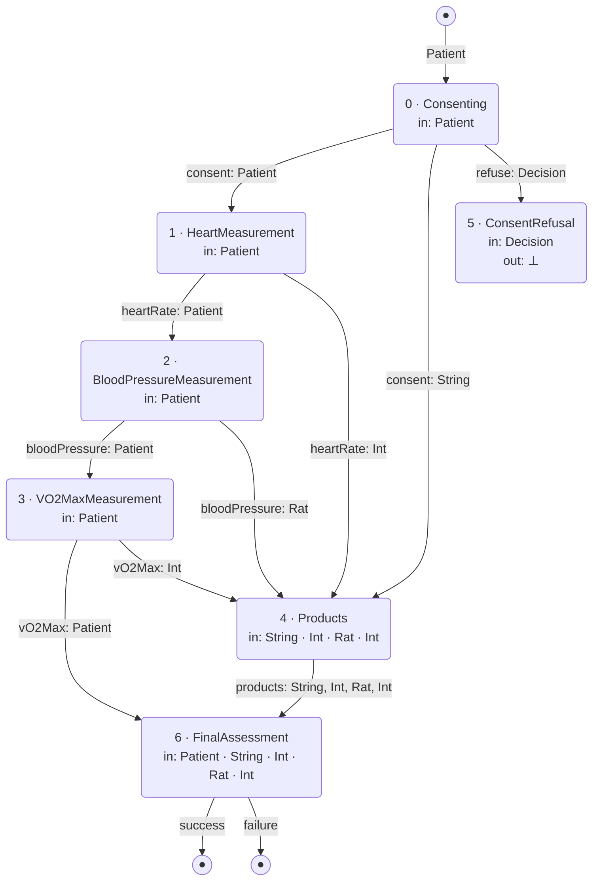

# alicePipeline

Type-level wiring diagram for `alicePipeline` defined in `lean4/WorldModel/KB/Boxes.lean`.

## Stage descriptions

| # | Type | Inputs | Outputs |
|---|------|--------|---------|
| 0 | `Consenting` | `Patient` | `consent: Patient, String` · `refuse: Decision` |
| 1 | `HeartMeasurement` | `Patient` | `heartRate: Patient, Int` |
| 2 | `BloodPressureMeasurement` | `Patient` | `bloodPressure: Patient, Rat` |
| 3 | `VO2MaxMeasurement` | `Patient` | `vO2Max: Patient, Int` |
| 4 | `Products` | `String, Int, Rat, Int` | `products: String, Int, Rat, Int` |
| 5 | `ConsentRefusal` | `Decision` | ⊥ (terminated) |
| 6 | `FinalAssessment` | `Patient, String, Int, Rat, Int` | `success: Patient, String, Int, Rat, Int` · `failure: Patient, String` |

## Wiring notes

- The **Patient token** threads through the main chain: `Consenting → HeartMeasurement → BloodPressureMeasurement → VO2MaxMeasurement → FinalAssessment`
- The **consent String** and each **measurement value** (Int, Rat, Int) are routed into `Products`, which packages them before forwarding to `FinalAssessment`
- The **refuse branch** carries the whole `Decision` value to `ConsentRefusal` (⊥) — no wires escape
- `FinalAssessment` receives all five values and produces either `success` or `failure`
- Validated at compile time via `by native_decide` in `pipeline!`
